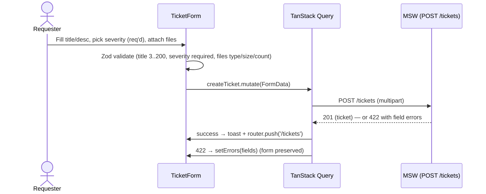
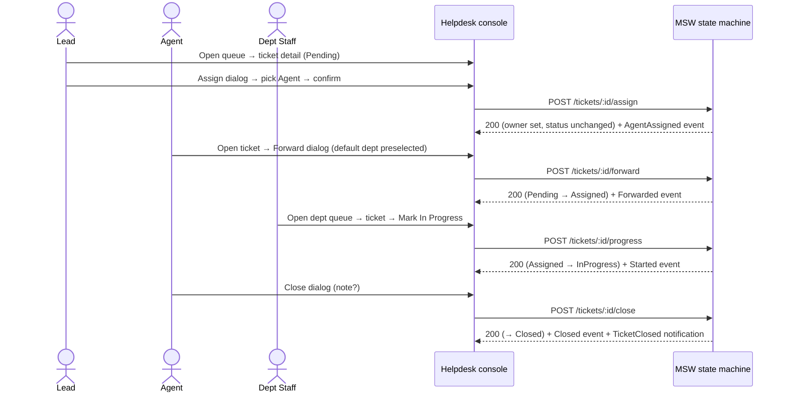
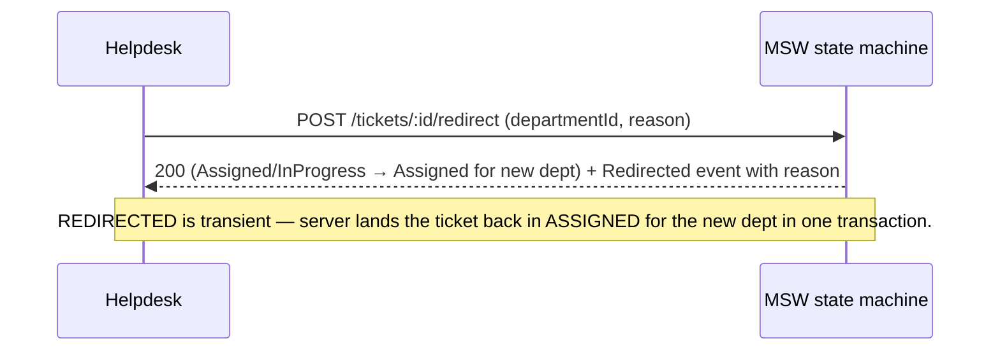
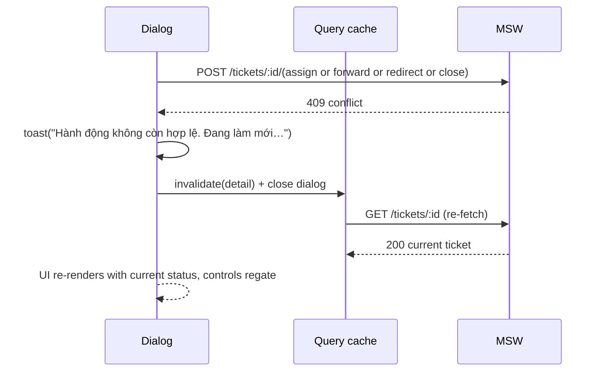
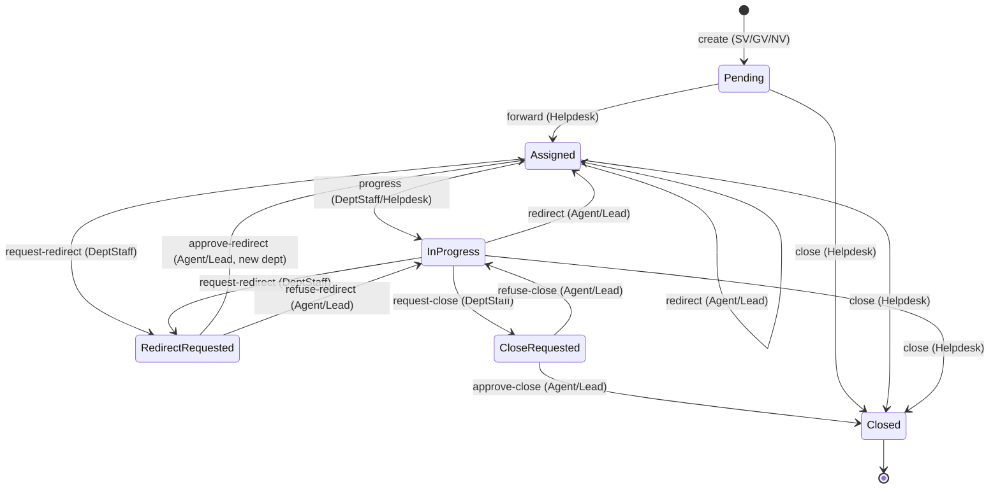

# Feature Plan (FE) — M31 Helpdesk / Ticket

| Field | Value |
|---|---|
| Module | **M31 — Helpdesk / Ticket** — **Front-end only** |
| Source Brief | `feat-helpdesk-ticket/docs/brief.md` |
| Type | Front-end design — UI/UX-first (`/sc:design --frontend --persona-frontend`) |
| Tier | Tier 3 (Feature Plan) → next: Test design + Implementation plan |
| Stack | Next.js 14 (App Router) · TypeScript · Tailwind · **shadcn/ui (Radix + CVA)** · lucide-react · TanStack Query · React Hook Form + Zod · sonner · MSW v2 · Vitest+RTL · Playwright |
| Backend | **Mocked (MSW)** — no real BE in this project; the contract in Appendix A is the seam |
| Language | English narrative; Vietnamese UI copy verbatim |

> **What this doc is.** A UI/UX-first design for the M31 front-end. The Brief covers *what/why*; this Feature Plan covers *how the FE looks, behaves, and is built*. The backend is not in scope — the FE codes against a documented, MSW-mocked contract (Appendix A), so swapping in a real BE later is a base-URL change.

---

## 0. Decisions carried from the Brief (27/05/2026)

| # | Decision | Where it lands in the UI |
|---|---|---|
| 0.1 | Notifications in-app only (close + 09:00 backlog reminder) | Bell + dropdown list; no email/push UI |
| 0.2 | "Lead assigns" — split Helpdesk into Lead (dispatch) + Agent (handler) | Assign dialog only visible to Lead |
| 0.3 | Attachments: images + documents on ticket + comments | FileUpload primitive with type/size guardrails |
| 0.4 | AI triage (M29) deferred | UI seam (placeholder suggestion area) — hidden by feature flag |
| 0.5 | `Backlog age = days since createdAt` | Shown on reminder + queue row |
| 0.6 | No reopen — `Closed` is terminal | Closed tickets are read-only; no "reopen" control |
| 0.7 | Close authority = Helpdesk Lead OR assigned Agent | Close control gated by RBAC + status |
| 0.8 | Reminder cadence Mon–Fri 09:00 ICT | FE renders reminders as data; cron lives in BE |

---

## 1. Scope & deliverable

### In scope (this project)
- **All UI surfaces** for the 7 roles: Requester (SV/GV/NV), Helpdesk Lead, Helpdesk Agent, Dept Staff, Admin, BGH/Admin (oversight).
- **Mocked API** (MSW) faithfully implementing the contract in Appendix A — including envelopes, error codes, and the §2 state machine — so loading/empty/error/409-refresh UX is exercised against realistic responses.
- **Mock SSO** (a role switcher) standing in for M1 IAM. Real SSO is a later integration; UI assumes a session-with-role on every request.
- **Design system** (tokens, primitives, composites) consumed by every screen.
- **A11y + responsive + i18n** baked in from day one, not bolted on.

### Out of scope
- Real backend (Express/Prisma/bullmq/ESB) — the Brief calls those out; this project does not build them.
- Real SSO / IAM wiring.
- M2 ESB and M3 Data Lake publishing.
- Production attachment storage / virus scanning.
- Email / Zalo / push delivery.

---

## 2. Tech stack & rationale

| Concern | Choice | Why |
|---|---|---|
| Framework | **Next.js 14 (App Router) + TS** | Modern default; layout/segment model fits per-surface shells; embeddable in M20/M21 |
| Styling | **Tailwind CSS** + shadcn CSS-variable theme | Token-first; shadcn's HSL design tokens give a coherent, themeable (light + dark-ready) system |
| **UI components** | **shadcn/ui** (Radix UI primitives + Tailwind + CVA) | Accessible, unstyled-by-default primitives we **own in-repo** — focus-trap / keyboard / ARIA for free, no runtime lock-in, better UX than hand-rolled |
| Icons | **lucide-react** (ships with shadcn) | Tree-shakeable per-icon SVGs |
| Data fetching | **TanStack Query** in Client Components | Caching, retries, optimistic updates, **409→invalidate** path is first-class |
| Forms | **React Hook Form + Zod** (`@hookform/resolvers`) via shadcn `Form` | shadcn's idiomatic stack: `FormField`/`FormMessage` auto-wire label, error text & `aria-invalid`; server `422 → form.setError`. *(Supersedes the earlier "controlled + Zod, no RHF" call now that we adopt shadcn.)* |
| Validation | **Zod** | One schema drives both the RHF resolver and server-error → field mapping |
| Toasts | **shadcn `Sonner`** (sonner under the hood) | Accessible toaster for success / error / 409-refresh affordance |
| Mock API | **MSW v2** | Same handlers in Vitest (node) and dev (browser); contract-accurate envelopes/errors |
| Unit / component tests | **Vitest + RTL + jsdom** | Fast, parallel; matches BE-repo Vitest convention |
| E2E + a11y | **Playwright + @axe-core/playwright** + **vitest-axe** | Full-flow + a11y coverage on real DOM |
| i18n | **Inline VN labels** (no i18n library v1) | One locale (vi-VN); a string map per surface keeps it light. Revisit when a second locale lands. |

> **Server vs Client Components.** Data-fetching + shadcn interactive components live in Client Components (so MSW + RTL can exercise them and Radix can hydrate). Server Components stay shells/layouts only — this shrinks the async-RSC Vitest gap.

**shadcn setup (as implemented):**
- **Base color `neutral`, CSS variables**, **light** in v1 (dark tokens present in `app/globals.css` `:root`/`.dark`, but no toggle yet). `components.json` + `cn()` in `lib/utils.ts`; `tailwind.config.ts` carries `darkMode: ["class"]`, the shadcn token colors, `borderRadius` vars, and `tailwindcss-animate`, keeping the `severity.*` palette as an extension.
- Components are **hand-authored from the shadcn sources** (the CLI is interactive + network-bound). **All UI is shadcn — no native form controls** (the only native element is the hidden `<input type=file>` inside `file-upload`). Present: `button input textarea form label radio-group checkbox table badge card alert skeleton sonner pagination sheet dialog` + **`select toggle toggle-group dropdown-menu popover command combobox`** (added in the 2026-05-29 shadcn migration). `filter-bar` composes `ToggleGroup` + `Select` into the shared filter primitives.
- **Radix-in-jsdom:** `Select`/`Combobox`/`DropdownMenu` don't open in jsdom → their interactions are covered by Playwright; `ToggleGroup`/`Dialog`/`RadioGroup` work in jsdom (see `test-design.md` §1.1/§1.3).
- **MSW browser worker** is wired via `MswReady` (`app/providers.tsx`) + `public/mockServiceWorker.js`, so the running app serves mock data with no real BE.
- Deps: `class-variance-authority`, `clsx`, `tailwind-merge`, `lucide-react`, `tailwindcss-animate`, `react-hook-form`, `@hookform/resolvers`, `cmdk`, `@radix-ui/react-{slot,label,radio-group,checkbox,dialog,select,toggle,toggle-group,dropdown-menu,popover}`. `sonner` + `zod` pre-existing.
- **Font:** **Inter** via `next/font/google` (`latin` + `vietnamese` subsets), exposed as `--font-sans` and wired to Tailwind's `font-sans`; system sans is the fallback stack.

---

## 3. Personas, surfaces & role matrix

> Canonical RBAC source of truth: **[`role-permission-matrix.md`](./role-permission-matrix.md)**. The table below reflects it; **if the two diverge, the matrix wins**.

| Role | Primary surface | Top tasks | Visible nav |
|---|---|---|---|
| SV / GV / NV (Requester) | **Requester** | Create ticket · track my tickets · receive close notice · comment | Tạo yêu cầu · Yêu cầu của tôi · Bell |
| Helpdesk Agent | **Helpdesk console** | Handle queue · forward · redirect · override severity · mark In Progress · close · comment · daily reminder | Hàng đợi · Bell |
| Helpdesk Lead | **Helpdesk console** | All Agent capabilities **+ assign** Agent · dashboard · daily reminder | Báo cáo · Hàng đợi · Bell |
| Dept Staff (phòng ban) | **Dept queue** | Dept queue · mark In Progress · comment + attach · **may create personal tickets** (matrix) · daily reminder | Hàng đợi phòng ban · Bell |
| Admin | **Admin console** | Category tree · routing rules · view all tickets · dashboard · comment | Báo cáo · Tất cả yêu cầu · Danh mục · Định tuyến · Bell |

**Role-driven nav** — a role never sees a control it cannot perform (not even disabled). Server RBAC is still the authority; the UI is defense-in-depth. The nav is a **role-driven sidebar** (sectioned, with a user footer) — a fixed rail at `md:+` and a hamburger → `Sheet` drawer below `md:` (UI design: [`ui-design/helpdesk-console.html`](./ui-design/helpdesk-console.html)). The "Bell" lands in Phase 6.

> Notes on Dept Staff: per matrix, `canCreate` and `canViewOwn` are both ✅, but the matrix's sidebar only lists the dept queue + notifications. The create/view-own capability is reachable via direct URL (`/tickets/new`, `/tickets`) and from a "Tạo yêu cầu" CTA on their queue header — it just isn't a primary sidebar entry in v1.
>
> Notes on Admin: the "Tất cả yêu cầu" nav points to the shared all-tickets queue route (the same view Helpdesk uses); the route guard allows Admin in addition to Helpdesk.

---

## 4. Information architecture

```
/                              → landing splash + "Bắt đầu" → /login (if logged out) or homeRouteFor(role) (if logged in)
/login                         → username + password form + slide-down credential helper note

(requester segment)
/tickets                       → My tickets (list, external statuses)
/tickets/new                   → Create ticket (form)
/tickets/[id]                  → Ticket detail (external status, timeline)

(helpdesk segment)
/helpdesk/queue                → Intake / handling queue
/helpdesk/tickets/[id]         → Ticket detail (internal status + actions)

(dept-staff segment)
/staff/queue                   → Department's unsolved queue
/staff/tickets/[id]            → Ticket detail (progress + comment)

(admin segment)
/admin/categories              → Category tree CRUD
/admin/routing                 → Routing rules CRUD

(shared)
/analytics                     → Module dashboard
/notifications                 → Full notifications list (the bell expands to a dropdown)
/403, /404, /500               → Explicit error views (never blank)
```

**Route group strategy** — App Router groups by surface (`(requester)`, `(helpdesk)`, `(staff)`, `(admin)`) so each can carry its own layout (filters bar, breadcrumbs) without polluting URLs.

---

## 5. Screen inventory + wireframes

> ASCII wireframes are intent, not pixels. Tailwind layout, spacing, and breakpoints land in §7 and §10.

### 5.0 Entry points — Landing (`/`) and Login (`/login`)

**Landing (`/`)** — full-bleed brand splash (DAU diamond logo + "DAU Helpdesk" title + short tagline + "Bắt đầu →" CTA). Three pillar icons (Account / Technical / Knowledge) sit below the CTA on `sm:+`, hidden on mobile to keep the small viewport focused on the action. Click "Bắt đầu" → 2 s `LoadingSplash` (the last 500 ms scale-up + fade-out exit animation) → `router.push('/login')` if logged out, or `homeRouteFor(role)` if already logged in.

**Login (`/login`)** — email + password form, centered card. A dismissible **slide-down credential note** docks at the top of the page on mount:

```
┌── Note (slides down from top) ───────────────────────────────── X ─┐
│ Trang thử nghiệm — Helpdesk module của UMS                          │
│ 2–3 sentences pulled from brief.md (problem + objective + demo      │
│ disclaimer).                                                        │
│ ── Vai trò ──────────────────────────────────────────────────────── │
│ [ SV ] [ GV ] [ NV ] [ Helpdesk Lead ] [ Agent ] [ Staff ] [ Admin ]│
│                                                                     │
│ ── Persona (clicking reveals credentials) ──────────────────────── │
│  ○ SV Nguyễn Văn A      ○ SV Phạm Thị D                            │
│  Email: sv01@ums.edu.vn    Password: sv01-demo!                     │
└─────────────────────────────────────────────────────────────────────┘
┌── Login form ────────────────────────────────────────────────────┐
│ Đăng nhập                                                          │
│ Email      [_______________]                                       │
│ Mật khẩu   [_______________]                                       │
│                                          [ Đăng nhập ]            │
└────────────────────────────────────────────────────────────────────┘
```

Key UX:
- The note is **always visible on mount**, dismissible via the X button, reopens fresh on every `/login` visit (no "don't show again" persistence — it's a help panel, not a banner).
- Note copy is sourced from `brief.md` plus a "This is a testing build" disclaimer.
- Role tabs are a `Tabs` component; each tab body lists the personas in that role with their credentials revealed on click. Clicking a persona auto-fills the form's `Email` field (and shows the password as copy-paste-able text — not auto-filled, so the reviewer feels the login motion).
- Submit → `POST /auth/login { email, password }` → on 200 the cookie is set by the BE and `SessionProvider` rehydrates via `GET /auth/me` → redirect to `homeRouteFor(role)`. On 401 → field-agnostic error message "Sai email hoặc mật khẩu" so the reviewer can't enumerate.
- Route guard (see §11.5): any non-`/`, non-`/login` route hit without a valid session redirects here and remembers the intended destination so login can route back to it.

### 5.1 Requester — New Ticket (`/tickets/new`)

**Two-column at `lg:` — form (left) + helper panel (right); stacks on mobile (form, then helper).**

```
Tạo yêu cầu hỗ trợ
┌──────────────────────────────────┐   ┌──────────────────────────┐
│ Tiêu đề *          [___________]  │   │ Hướng dẫn điền           │
│ Danh mục (tuỳ chọn) [ ───── ▾ ]   │   │ 1. Tiêu đề ngắn gọn…     │
│ Mức độ *   🔴 🟠 🟡 🟢            │   │ 2. Chọn danh mục…        │
│ Mô tả *            [___________]  │   │ 3. Chọn mức độ…          │
│                    [           ]  │   │ 4. Mô tả chi tiết…       │
│ Đính kèm [ Chọn tệp… ] ≤10MB ×5   │   ├──────────────────────────┤
│  📄 report.pdf ✕  🖼️ a1.jpg ✕     │   │ Mức độ ưu tiên           │
│                  [ Gửi yêu cầu ]  │   │ 🔴 Critical — …          │
└──────────────────────────────────┘   │ 🟠 🟡 🟢 — …             │
                                        └──────────────────────────┘
```

Field order: **Tiêu đề → Danh mục → Mức độ → Mô tả → Đính kèm**.

Key UX:
- Severity is the only **mandatory enum**, shown as a **row of selectable tinted cards** (big emoji + label + VN label; selected card gets a colored ring) — three channels; S1-X1: a Zod field error stops submission. 2-up on mobile, 4-up at `sm:`.
- Category is optional — Helpdesk classifies later.
- Attachments validated client-side (type, size, count) **and** server-side (422 maps to the file field).
- **Helper panel** (`CreateTicketGuide`) — fill guide + a severity-explanation table; on the right at `lg:`, below the form on mobile.

### 5.2 Requester — My Tickets (`/tickets`)

```
┌─────────────────────────────────────────────────────────────┐
│  Yêu cầu của tôi                                            │
│  [🔍 Tìm tiêu đề/mô tả…]   [Danh mục ▾]   [Sắp xếp ▾]        │
│  Trạng thái: (Đã tiếp nhận)(Đang xử lý)(Hoàn tất)            │
│  Mức độ: (🔴 Critical)(🟠 High)(🟡 Medium)(🟢 Low)   [Xóa lọc]│
├─────────────────────────────────────────────────────────────┤
│  HD-2026-000123  Mất điện phòng A1.05      🟠 High   🟦 Đang xử lý │
│  HD-2026-000119  Không đăng nhập UMS       🔴 Critical 🟦 Đã tiếp nhận│
│  HD-2026-000115  Xin xác nhận sinh viên   🟢 Low     🟩 Hoàn tất    │
│                                          [ Trang 1/3  ‹  › ] │
└─────────────────────────────────────────────────────────────┘
```

External statuses only — requesters never see internal states. A **filter engine**
(`TicketFilters`) drives the list: free-text search (`q`), **external-status** chips
(mapped to the internal-status sets the API expects), **severity** chips, a **category**
select, and **sort** (newest/oldest/severity) — all server-side via `GET /tickets`, with
a "Xóa lọc" reset. Responsive: a desktop table and stacked mobile cards.

### 5.3 Requester — Ticket Detail (`/tickets/[id]`)

```
┌─────────────────────────────────────────────────────────────┐
│  HD-2026-000123   🟠 High   🟦 Đang xử lý                    │
│  Mất điện phòng A1.05                                       │
│  Cơ sở vật chất · Phòng Quản trị CSVC                       │
├─────────────────────────────────────────────────────────────┤
│  Mô tả                                                      │
│  Phòng học A1.05 mất điện từ đầu giờ sáng…                  │
│                                                             │
│  Tệp đính kèm                                               │
│   🖼️ a1-05.jpg                                              │
│                                                             │
│  Lịch sử xử lý                                              │
│   27/05 09:12 · Tạo yêu cầu        — SV Nguyễn Văn A         │
│   27/05 09:30 · Gán nhân viên       — Helpdesk Lead          │
│   27/05 09:45 · Chuyển đến phòng ban — Helpdesk Agent        │
│   27/05 10:02 · Bắt đầu xử lý        — CB Phòng CSVC          │
└─────────────────────────────────────────────────────────────┘
```

> **Desktop:** 2-column — detail (left) + a **"Yêu cầu khác của bạn"** panel (right) listing the user's other open tickets (empty → "Không còn yêu cầu nào khác."); stacks on mobile. Type scale + row spacing enlarged so the page reads comfortably.

### 5.4 Helpdesk — Queue (`/helpdesk/queue`)

```
┌──────────────────────────────────────────────────────────────────┐
│  Hàng đợi Helpdesk                                                │
│                                                                  │
│  Trạng thái [ Chưa đóng ▾ ]   Mức độ [☐🔴][☐🟠][☐🟡][☐🟢]          │
│  Nhân viên  [ Tất cả     ▾ ]   Tìm kiếm [               ] [ Tìm ] │
├──────────────────────────────────────────────────────────────────┤
│  HD-2026-000124  Wifi chậm khu B   🟠 High  🟧 Chờ tiếp nhận  Chưa gán │
│  HD-2026-000123  Mất điện A1.05    🟠 High  🟦 Đang xử lý     u-hda │
│  HD-2026-000122  Sai thông tin     🟡 Med   🟪 Đang chuyển… u-hda2 │
│                                                                  │
│  Trang 1/4   ‹  ›                                                │
└──────────────────────────────────────────────────────────────────┘
```

Internal status badges (5 states). Severity multi-select. Assignee filter. Row link → detail.

### 5.5 Helpdesk — Ticket Detail (`/helpdesk/tickets/[id]`)

```
┌──────────────────────────────────────────────────────────────────┐
│  HD-2026-000124   🟠 High   🟧 Chờ tiếp nhận                       │
│  Wifi chậm khu B                                                  │
│  IT / Hệ thống số · Chưa giao · Chưa gán nhân viên                 │
│                                                                  │
│  [ Gán nhân viên ] [ Chuyển phòng ban ] [ Điều chỉnh mức độ ]      │
│  [ Đóng yêu cầu ]                                                 │
├──────────────────────────────────────────────────────────────────┤
│  Mô tả …                                                         │
│  Tệp đính kèm …                                                  │
│  Lịch sử xử lý …                                                 │
└──────────────────────────────────────────────────────────────────┘
```

Action toolbar is the heart of this screen. **Buttons render only when both (role) AND (current status) permit the transition** — see §11. The 5 dialogs (Assign, Forward, Redirect, SeverityOverride, Close) open as modal sheets with focus trap.

### 5.6 Dialog pattern — Assign / Forward / Redirect / SeverityOverride / Close

```
        ╔══════════════════════════════════════════╗
        ║  Gán nhân viên Helpdesk             ✕   ║
        ╟──────────────────────────────────────────╢
        ║  Tìm nhân viên [                ]        ║
        ║  Nhân viên Helpdesk                      ║
        ║   [ — Chọn —              ▾ ]            ║
        ║                                          ║
        ║                  [ Huỷ ]   [ Gán ]       ║
        ╚══════════════════════════════════════════╝
```

All dialogs are shadcn `Dialog`s (Radix gives focus-trap + ESC + backdrop close) sharing: title, primary button disabled while pending, server-error → field-error mapping via RHF, **409 → toast + invalidate + close** (the canonical "stale state" UX).

### 5.7 Dept Staff queue (`/staff/queue`)

Same layout as Helpdesk queue but scoped server-side to the caller's department. Header is "Hàng đợi phòng ban". Row action: open detail → mark *In Progress* + comment.

### 5.8 Admin — Categories & Routing

```
Categories                              Routing rules
┌──────────────────────────┐            ┌──────────────────────────────────┐
│ + Thêm danh mục          │            │ Danh mục → Phòng ban         Mặc │
├──────────────────────────┤            ├──────────────────────────────────┤
│ ▸ IT / Hệ thống số        │            │ IT/Hệ thống số → CAIRA/IT   ✓   │
│ ▸ Cơ sở vật chất          │            │ CSVC → Phòng QT CSVC        ✓   │
│ ▸ Học vụ / Đào tạo        │            │ Học vụ → Phòng Đào tạo      ✓   │
│ ▸ Tài chính               │            │ + Thêm quy tắc                  │
│ ▸ Nhân sự (HCNS)          │            └──────────────────────────────────┘
│ ▸ Khác                    │
└──────────────────────────┘
```

Tree CRUD with **delete guard** (children or live tickets block delete). Routing rules use the same tree to pick a category, then a department.

### 5.9 Notifications bell + list

```
        🔔(3)
        ┌─────────────────────────────────────────┐
        │  Thông báo                  [Xem tất cả]│
        ├─────────────────────────────────────────┤
        │ • Yêu cầu HD-2026-000119 đã được đóng    │
        │   27/05 14:02                            │
        │ • Nhắc nhở: 3 yêu cầu tồn đọng (Mon 09:00)│
        │   27/05 09:00                            │
        │ • Bạn được gán HD-2026-000124            │
        │   26/05 16:31                            │
        └─────────────────────────────────────────┘
```

Daily reminder renders each backlog ticket with severity + `backlogAgeDays`.

### 5.10 Analytics dashboard (`/analytics`)

```
┌──────────────────────────────────────────────────────────────────┐
│  Báo cáo Helpdesk                                                │
│  ┌──────────┐ ┌──────────┐ ┌──────────┐ ┌──────────┐             │
│  │ Tổng số  │ │ Chưa đóng│ │ Đã đóng  │ │ Tuổi TB  │             │
│  │   312    │ │    47    │ │   265    │ │  2.4 d   │             │
│  └──────────┘ └──────────┘ └──────────┘ └──────────┘             │
│                                                                  │
│  Theo mức độ                  Theo phòng ban                      │
│  🔴 21  🟠 64  🟡 142  🟢 85   IT 78 · CSVC 92 · Đào tạo 60 · …    │
└──────────────────────────────────────────────────────────────────┘
```

Empty / error / loading states explicit (§8). Drill-down click → queue filtered by that facet.

---

## 6. User flows

### 6.1 Create ticket (Requester)



### 6.2 Lead → Agent → Dept → Close (Helpdesk happy path)



### 6.3 Redirect (mis-routed)



### 6.4 Stale state — 409 refresh (cross-cutting)



---

## 7. Design system

### 7.1 Color tokens

**Base theme — shadcn CSS variables** (HSL, in `app/globals.css`, `:root` + `.dark`): `--background` / `--foreground`, `--card`, `--popover`, `--primary`, `--secondary`, `--muted`, `--accent`, `--destructive`, `--border`, `--input`, `--ring`. Every neutral/semantic colour references a token, so re-theming is a one-file change. **v1 ships light**; dark tokens are present but the toggle (`next-themes`) is deferred.

**Severity** — the `severity.*` palette stays a `tailwind.config.ts` extension (for any solid accents), but **`SeverityBadge` renders as a soft tint** (UI design: helpdesk-console.html) aligned to the emoji colour:

| Severity | Emoji | VN label | Badge (soft tint) |
|---|---|---|---|
| Critical | 🔴 | Nghiêm trọng | `bg-red-100 text-red-800` |
| High | 🟠 | Cao | `bg-orange-100 text-orange-800` |
| Medium | 🟡 | Trung bình | `bg-yellow-100 text-yellow-800` |
| Low | 🟢 | Thấp | `bg-green-100 text-green-800` |

Severity is always communicated through **three channels** (color **+** emoji **+** label) so it survives color-blindness, monochrome printing, and screen-readers — never color alone.

**Status pills** — rendered with shadcn `Badge` (custom `variant`s via CVA, not raw utilities):
- External (requester view): `Requested` → neutral · `Processing` → info (blue) · `Finished` → success (green).
- Internal (Helpdesk/Staff/Admin view): `Pending` → neutral · `Assigned` → amber · `InProgress` → blue · `Redirected` → purple · `Closed` → green.

**Action intent → shadcn `Button` variant:** primary = `default`, secondary = `secondary`/`outline`, destructive (Close) = `destructive`, low-emphasis = `ghost`. Focus ring is the shadcn `--ring` token; Radix manages focus visibility.

**Brand accent (red):** the sidebar is a light-red panel (`bg-red-50` + `border-r border-red-100`) so it reads as a distinct block from the white main content; logo tile + avatar `bg-red-600`; active nav `border-red-600 bg-red-100 text-red-700`. Accent cards (e.g. the related-tickets panel — `border-t-4 border-t-red-600` + red title) also use the red accent. (The console mockup used blue; the app adopts red per the latest design direction. The global content theme stays neutral white.)

### 7.2 Typography & spacing

- Font: **Inter** via `next/font/google` (`latin` + `vietnamese`), set as `--font-sans` → Tailwind `font-sans`; system sans stack is the fallback.
- Sizes: `text-xs` (meta/code), `text-sm` (body), `text-base` (form labels), `text-lg` (dialog titles), `text-xl` (page H1).
- Weight: `font-medium` for labels & list titles; `font-semibold` for H1/H2/dialog titles.
- Spacing scale: Tailwind defaults (`gap-1`, `gap-2`, `gap-3`, `gap-4`, `p-3`, `p-4`, `p-6`); container padding `p-6` desktop, `p-4` mobile.

### 7.3 Component inventory (built on shadcn/ui)

> **Built:** Button · Input · Textarea · Form/Label · RadioGroup · Checkbox · Table · Badge · Card · Alert · Skeleton · Sonner · Pagination · Sheet · Dialog · **Select · Toggle · ToggleGroup · DropdownMenu · Popover · Command · Combobox** (full shadcn set after the 2026-05-29 migration). Agent/dept pickers use the shadcn **`Combobox`** (the earlier native-`<select>` `SearchableSelect` was removed); their open→pick interactions are e2e (test-design §1.1).
>
> **Layout shell** (`components/layout/`): `AppShell` + `Sidebar` (+ `SidebarContent`, `RoleSwitcher`) — responsive (fixed rail at `md:`, `Sheet` drawer below).

**From shadcn (hand-authored from shadcn sources, owned in `components/ui/`)**
| Need | shadcn component | Notes |
|---|---|---|
| Buttons | `Button` | variants: default / secondary / outline / destructive / ghost |
| Text inputs | `Input`, `Textarea` | used inside `Form` fields |
| Form scaffolding | `Form`, `FormField`, `FormItem`, `FormLabel`, `FormControl`, `FormMessage`, `Label` | RHF + Zod; auto `aria-invalid` + error text |
| Status / category / assignee / sort filter | `Select` (+ shared `FilterSelect`) | shadcn; interaction in e2e |
| Searchable picker (agent / dept) | **`Combobox`** (`Popover` + `Command`/cmdk) | shadcn; interaction in e2e (test-design §1.1) |
| Multi-select chips (status / severity filter) | **`ToggleGroup`** (`type="multiple"`, via `FilterChipGroup`) | jsdom-safe (buttons); solid-red when selected |
| Toggles | `Checkbox`, `RadioGroup` | severity pick & override (radio); admin "default" flag (checkbox) |
| Dialogs | `Dialog` | Radix focus-trap + ESC + backdrop — replaces the hand-rolled `Modal` |
| Menus | `DropdownMenu` | notification bell, queue-row actions |
| Tables | `Table` | queue lists (replaces ad-hoc `ul/li`) |
| Cards | `Card` | dashboard tiles, ticket summary blocks |
| Badges | `Badge` (custom variants) | base for the three pill wrappers below |
| Loading | `Skeleton` | list/detail loading state |
| Toasts | `Sonner` | app-level `<Toaster />` |
| Pagination | `Pagination` | queue/list paging |
| Misc | `Tabs`, `Tooltip`, `Alert` | admin tabs, hints, error banners |

**Custom (no shadcn equivalent — composed from the above)**
| Component | Built on | Purpose |
|---|---|---|
| `SeverityBadge` / `StatusBadge` / `InternalStatusBadge` | `Badge` | the three pill types + VN labels |
| `EmptyState` | `Card` | empty list/detail with optional CTA |
| `FileUpload` | `Input[type=file]` + `Badge` | multi-file with type/size/count guard |
| `AccessDenied` | `Alert` | explicit 403 view (never blank) |
| `Timeline` | plain `<ol>` | audit events with VN labels |
| `DataState` | `Skeleton`/`Alert`/`EmptyState` | one wrapper that renders the §8 loading/empty/error/success states uniformly |

**Composites** (`components/tickets/`, `components/helpdesk/`, `components/notifications/`, `components/admin/`, `components/analytics/`) — `TicketForm`, `TicketList`, `TicketDetail`, `Timeline`, `AttachmentList`, `CommentBox`; `HelpdeskQueue`, `HelpdeskTicketDetail`, `AssignDialog`, `ForwardDialog`, `RedirectDialog`, `SeverityOverrideDialog`, `CloseDialog`; notification bell/list, admin tree/routing, analytics dashboard — now **assembled from shadcn primitives** instead of hand-rolled ones.

### 7.4 Iconography
- **lucide-react** (ships with shadcn), imported per-icon so it tree-shakes: e.g. `Bell` (notifications), `X` (dialog close), `ChevronLeft/Right` (pagination), `Paperclip` (attachments), `Search` (pickers).
- Status / severity stay **emoji + label** (not icon-only) to keep the three-channel a11y guarantee (§7.1) — icons are decorative chrome, never the sole signal.

---

## 8. Interaction-state matrix

Every list/detail/form **must** declare four states. Tests assert all four.

| State | Visual | Copy (VN) | Behavioural |
|---|---|---|---|
| **Loading** | `Skeleton` rows / blocks · `aria-busy="true"` on container | — | No spinners; perceived speed via skeletons |
| **Empty** | `EmptyState` dashed-border card | "Chưa có yêu cầu nào" / "Không có yêu cầu khớp bộ lọc" | Primary CTA when relevant (e.g. "Tạo yêu cầu") |
| **Error** | `role="alert"` red text; retry button when applicable | per-status (see below) | No data leak on 403 |
| **Success** | Filled content; on mutation: `sonner` toast + cache invalidation | "Đã tạo yêu cầu HD-2026-000123" | Navigate where appropriate |

**Cross-cutting error map** (every mutation flows through this):

| HTTP | UI | Copy / Action |
|---|---|---|
| 400 / 422 | Field errors via Zod path or server `error.fields` | Form preserved; focus first invalid field |
| 401 | Route to `/login` (mock); keep intended URL for return | "Phiên đăng nhập hết hạn" |
| 403 | `AccessDenied` view or hide control | "Bạn không có quyền truy cập khu vực này." |
| 404 | Explicit not-found view | "Không tìm thấy yêu cầu." |
| 409 | **Toast + invalidate detail + close dialog** | "Hành động không còn hợp lệ. Đang làm mới…" |
| 5xx / network | Error state with retry | "Đã xảy ra lỗi, vui lòng thử lại." |

---

## 9. Accessibility plan (WCAG 2.1 AA)

> **Radix gives us a baseline for free.** shadcn's Radix-based `Dialog`, `DropdownMenu`, `Select`, `Combobox`, `RadioGroup`, `Tabs`, and `Tooltip` ship correct focus management, keyboard interaction, and ARIA roles/states. We still run axe and own everything below.

- **Semantics:** native/Radix elements first; landmarks `<nav> <main> <article> <section>`; one `<h1>` per page.
- **Focus management:** Radix `Dialog`/`DropdownMenu` trap focus, restore to the opener on close, and close on ESC out of the box; we only set the right initial focus target.
- **Forms:** every input has a `<label htmlFor>`; errors via `role="alert"` and `aria-invalid="true"`; required marked with `*` AND `aria-required="true"`.
- **Severity / status:** color **+** emoji **+** label (§7.1).
- **Live regions:** toasts via sonner (`role="status"`); mutation results announce.
- **Keyboard map:**
  - `Tab` / `Shift+Tab` — navigate
  - `Enter` — submit form, activate primary
  - `ESC` — close dialog
  - `/` — focus search in queue (post-MVP)
- **Contrast:** all text ≥ 4.5:1 on background; status pills tested with axe.
- **Tooling:** `vitest-axe` per primitive; `@axe-core/playwright` per page; **0 critical violations** is the gate.

---

## 10. Responsive plan

> **Standing rule:** every layout ships **both** a mobile and a desktop variant (mobile-first) — never desktop-only. Build the small-screen layout first, then enhance up.

**Mobile-first** with Tailwind breakpoints:

| Breakpoint | Width | Layout |
|---|---|---|
| default | <768px | **Sidebar collapses to a hamburger → `Sheet` drawer**; single-column content; tables scroll (`overflow-x`) or reflow to stacked cards; filters wrap |
| `md:` | ≥768 | **Fixed sidebar rail** + content column; filter bar in one row; detail header inlines code+badges |
| `lg:` | ≥1024 | Optional two-column detail (body left, timeline right) |

- **Touch targets** ≥ 44×44 (Tailwind `py-2` + `px-3` baseline on Buttons; explicit `min-h` on icon-only buttons).
- **Embed-safe:** no fixed-position chrome that escapes an iframe; modals use `position: fixed` *inside* the embed root, not body.
- **Long content:** timeline scrolls vertically inside its section; ticket descriptions use `whitespace-pre-wrap` and clamp at viewport.

---

## 11. State management & data fetching

**TanStack Query keys (single source of truth):**

```ts
ticketKeys = {
  all: ['tickets'],
  list: (q) => ['tickets', q],
  detail: (id) => ['ticket', id],
  history: (id) => ['ticket', id, 'history'],
}
catalogKeys = { categories: ['categories'], departments: ['departments'],
                agents: ['agents'] }
notificationKeys = { all: ['notifications'] }
authKeys = { me: ['auth', 'me'] }   // GET /auth/me — drives SessionProvider state
```

**Mutation discipline:**
- Each mutation hook (`useAssignAgent`, `useForwardTicket`, `useRedirectTicket`, `useOverrideSeverity`, `useCloseTicket`, `useStartProgress`) invalidates `detail(id)` + `history(id)` + `all` on success.
- `onError` (in dialog) goes through a single helper `handleMutationError(err, { onConflict, onFields, fallbackMessage })` that owns the §8 cross-cutting map.
- `422` field errors are applied to the form via RHF `form.setError(field, { message })`; the dialog/form stays open with values intact.

**RBAC + state-machine guards (UI)** — role guard names mirror the matrix's `can*` functions (see [`role-permission-matrix.md`](./role-permission-matrix.md) §Implementation notes).

| Control | Role guard (from matrix) | Status guard |
|---|---|---|
| Create ticket | `canCreate` (SV/GV/NV/DeptStaff) | — |
| View own tickets | `canViewOwn` (SV/GV/NV/DeptStaff) | — |
| View all-tickets queue | `canViewQueue` (Agent/Lead/Admin) | — |
| View dept queue | `canViewDeptQueue` (DeptStaff/Admin) | — |
| Comment | `canComment` (all authenticated roles) | — *(open: behaviour on Closed tickets — TBD; default: still allowed)* |
| Assign agent | `canAssign` (Lead) | `status ≠ Closed` |
| Forward | `canForward` (Agent/Lead) | `status ∈ {Pending, Redirected}` |
| Redirect | `canRedirect` (Agent/Lead) | `status ∈ {Assigned, InProgress}` |
| Override severity | `canOverrideSeverity` (Agent/Lead) | `status ≠ Closed` |
| Mark In Progress | `canUpdateProgress` (Agent/Lead/DeptStaff) | `status = Assigned` |
| Close | `canClose` (Agent/Lead) **+ ownership backstop**: Lead, or the assigned Agent (Brief §0.7) | `status ≠ Closed` |
| Dashboard | `canViewDashboard` (Lead/Admin) | — |
| Manage categories | `canManageCategories` (Admin) | — |
| Manage routing | `canManageRouting` (Admin) | — |

The UI never shows a control whose role guard is unmet AND only shows transition controls when the status guard is met. The server `409` is the race backstop. **Close has both a role guard *and* an ownership backstop**: a Helpdesk Agent who isn't the ticket's assignee sees no Close control (UI), and the server rejects with 403 if the FE check were bypassed.

### 11.5 Auth state & route guard

Demo build: the SessionProvider's `user` state is sourced from `GET /auth/me`, not localStorage. Boot sequence:

1. `SessionProvider` mounts → calls `useAuthMe()` (`useQuery({ queryKey: authKeys.me, queryFn: getMe, retry: false })`).
2. While the query is in flight → `isReady=false`. AppBootGate shows the brand `LoadingSplash`.
3. On 200 → `user` is populated from the response. On 401 → `user = null` (not authenticated).
4. `isReady` flips true regardless of outcome; render proceeds.

**Route guard** — a lightweight client-side `<AuthGate>` component sits inside the AppShell layout and reads `usePathname()` + `user`:

| Path | `user === null` | `user !== null` |
|---|---|---|
| `/` (landing) | render landing | render landing (still passes the gate; clicking "Bắt đầu" routes them to home) |
| `/login` | render login page | redirect to `homeRouteFor(role)` |
| anywhere else | redirect to `/login?next=<encoded>` | render the route |

Login success → `POST /auth/login` returns the `user`, the FE writes it into the `authKeys.me` cache directly (so we don't wait on a second `GET /auth/me` round trip) and `router.push(decodeURIComponent(next) || homeRouteFor(user.role))`.

Logout (from either the top-bar button or the sidebar footer) → `POST /auth/logout` → on success clear the `authKeys.me` cache + `queryClient.clear()` (wipe all per-user data) → `router.push('/login')`.

**Identity transition window** (carried from the previous role-switcher era) — `SessionProvider` still exposes `isTransitioning` for a ~200 ms window after `user` changes, so `AppBootGate` keeps the splash up while every subscriber (bell, lists, dashboards) refetches against the new identity's cookie. Same purpose as before, different trigger.

---

## 12. Forms & validation (React Hook Form + Zod via shadcn)

Forms use shadcn's `Form` (React Hook Form) with `zodResolver`. One Zod schema per form drives **both** client validation and the server-error mapping. Schemas (and their VN error copy) live in `lib/validation/schemas.ts`:

```text
createTicketSchema:  title 3..200, description 1..5000, severity REQUIRED, categoryId?
forwardSchema:       departmentId required
redirectSchema:      departmentId required, reason 3..500
assignSchema:        agentId required (must resolve to a HELPDESK_AGENT — server check)
closeSchema:         note? <=2000
commentSchema:       body 1..5000
```

Attachment rules (mirrored from §A for UX; server is the authority):
- MIME allowlist: `jpg/png/webp/gif` + `pdf/doc/docx/xls/xlsx`
- Per file: ≤ 10 MB
- Per submission: ≤ 5 files

**Wiring:** `useForm({ resolver: zodResolver(schema) })` → each `FormField` renders `FormLabel` / `FormControl` / `FormMessage` (auto `aria-invalid` + error text). On submit: RHF validates → `mutate` → on `422`, `form.setError(field, { message })` per `error.fields`. Form values are **never reset on error**. The `FileUpload` and `Combobox` pickers are registered as RHF controlled fields (`Controller`).

---

## 13. Notifications (in-app, FE rendering)

- Bell shows unread count (cap label at "9+").
- Dropdown shows the 5 most recent; "Xem tất cả" → `/notifications`.
- Newest-first; mark-read on click; failure to mark stays unread with retry affordance (S9-X1).
- `DAILY_REMINDER` payload `{tickets: [{ticketId, code, severity, backlogAgeDays}]}` — the FE renders one row per ticket with severity color and `n` ngày.
- **Recipients of the daily reminder** (`receivesDailyReminder` in the matrix): **Helpdesk Agent · Helpdesk Lead · Dept Staff**. Requesters and Admin do not receive it. Each role's backlog set is what they own: Agent → tickets they are assigned, Lead → un-assigned/un-forwarded queue items, DeptStaff → their dept's open tickets.
- Clicking a notification whose ticket now 403s → graceful "Yêu cầu không còn khả dụng" message (no crash) (S9-X2).

Cron (BE) is out of scope; the FE only renders the resulting notifications.

---

## 14. i18n & content strategy

- **Vietnamese** is the only locale in v1. Copy lives next to its component (no central JSON), so it's reviewable in the same PR as UX.
- A `lib/status/status.ts` carries the canonical label maps (`EXTERNAL_STATUS_VI`, `INTERNAL_STATUS_VI`, `EVENT_VI`).
- Domain terms (phòng ban, danh mục, mức độ, tồn đọng) stay verbatim — they're load-bearing in the brief.
- Dates: `Intl.DateTimeFormat('vi-VN')` — never hand-formatted strings.
- Numbers (counts, ages): plain digits + VN unit ("3 ngày").

---

## 15. Non-functional (FE)

- **Performance:** first interactive < 2s on a 4G profile; route-level code-split via App Router; images lazy.
- **Bundle:** runtime payload is `react-query` + `react-hook-form` + `zod` + `sonner` + Radix primitives (tree-shaken per shadcn component) + per-icon `lucide-react` + `tailwindcss-animate`; no icon font, no chart library in v1 (Analytics renders with CSS bars in shadcn `Card`s).
- **Resilience:** Query retries default + exponential backoff on 5xx; **no retry on 4xx**; offline → toast "Mất kết nối" + read-from-cache.
- **Security (FE):** never log PII / requestId payloads in production; XSS-safe by React default (no `dangerouslyInnerHTML`); attachments link via `target="_blank" rel="noreferrer"`; CSP-ready (no inline scripts).
- **Observability (FE):** every `ApiError` carries `requestId` from the envelope; surface it in toast/console for support correlation.

---

## 16. Risks & mitigations (FE)

| Risk | Mitigation |
|---|---|
| Race conditions on Helpdesk actions (two agents acting) | 409 path is first-class: toast + invalidate + close dialog → UI regates from current state |
| State-machine drift (UI shows an illegal control) | Co-locate guards in `lib/status/transitions.ts` + RBAC in `lib/auth/rbac.ts`; one place to audit |
| Mock contract drift from a future real BE | MSW handlers are the executable spec; Appendix A is the textual one. Any FE-driven addition (e.g. `GET /departments`, `GET /agents`) is flagged inline so the BE contract can absorb it. |
| A11y regressions | axe in unit + e2e CI; PR-blocking on critical |
| Embedded styling collisions in M20/M21 | Tailwind preflight scoped to the app root; no global CSS bleed; no fixed-to-body chrome |
| Vietnamese typography (long words / wrap) | Use `break-words` on titles; test wireframes at 320px width |
| shadcn components are copied into the repo (we own them) | Commit the generated files; re-running `npx shadcn add` can overwrite local edits — keep custom variants in **wrapper** files (`SeverityBadge`, etc.), not in the generated primitives; pin component source via review |

---

## 17. Acceptance criteria (FE-focused, per Story)

Mirrors `brief.md` §3 capabilities; full Given/When/Then lives in **`test-design.md`** (next step).

| Story | FE acceptance gist |
|---|---|
| S1 — Create ticket | Severity required; attachments validated client+server; 201 → My Tickets shows **Đã tiếp nhận** |
| S2 — RBAC & role-scoped UI | Each role sees only its nav/routes; deep-link to a denied area → `AccessDenied` (not blank) |
| S3 — Lead assigns | Assign control rendered only for Lead; searchable picker of HelpdeskAgents; 409 → refresh |
| S4 — Forward + routing rules | Default dept pre-selected from rule; "Khác" has no preselect; 409 → refresh |
| S5 — Redirect with history | reason 3..500 enforced; timeline shows `from→to + reason`; 409 → refresh |
| S6 — Dept progress | Mark In Progress reflects as **Đang xử lý** on requester view; no Close control for DeptStaff |
| S7 — Helpdesk close | Lead/assigned Agent only; → **Hoàn tất**; close notice in bell; no reopen control |
| S8 — Admin catalog | Add category appears on requester form; delete guard for children/live tickets |
| S9 — Notifications | Bell unread count; daily reminder renders per-ticket with severity + age; recipients = Agent / Lead / DeptStaff (matrix) |
| S10 — Audit + dashboard | Timeline chronological + actor; dashboard counts by severity/category/status |
| S11 — Demo login/logout | Logged-out user lands on `/login` with the credential helper note; valid creds → `homeRouteFor(role)`; bad creds → field-agnostic 401 toast; logout (from bell row or sidebar footer) → `/login`; deep-link without session → `/login?next=…` then back to the intended URL |
| S14 — Admin user directory *(2026-06)* | Admin-only `/admin/users` paged/filterable table + `/admin/users/[id]` detail; non-Admin → AccessDenied; no PII columns; right-side FilterDrawer mirrors the ticket list |
| S15 — Admin create user *(scope exception)* | `/admin/users/new`; institutional email + letters-only name; **Phòng ban shown only for DeptStaff**; optional password (blank ⇒ SSO-only); 409 dup → inline error; success → detail. Created users surface (identity-only) on the `/login` helper |
| S16 — Admin edit + soft delete *(scope exception)* | `/admin/users/[id]/edit` (email read-only, only-changed-fields PATCH); **Xóa** with confirm dialog, disabled on self; soft-deleted users vanish from the list + are blocked from SSO; re-creating their email revives the row |
| S17 — DeptStaff close request *(2026-06-11)* | DeptStaff (routed dept) on an InProgress ticket sees **Yêu cầu đóng** → dialog (comment required + optional images) → `CloseRequested`; the owning Agent/Lead sees **Duyệt đóng** / **Từ chối** (reason required, → InProgress). New internal status `Chờ duyệt đóng` (external still Processing); each step notifies the relevant party. Direct close by Agent/Lead unchanged |
| S18 — Direct redirect *(2026-06-11)* | Agent/Lead on an Assigned/InProgress ticket sees **Chuyển phòng khác** → dialog (dept picker excluding current + reason) → ticket re-routes, resets to Assigned, assignee kept |
| S19 — DeptStaff redirect request *(2026-06-11)* | DeptStaff (routed dept) sees **Xin chuyển phòng ban** → dialog (reason only) → `RedirectRequested`; the owning Agent/Lead sees **Duyệt chuyển** (picks the target dept) / **Từ chối** (reason → prior status). New internal status `Chờ duyệt chuyển` (external still Processing); each step notifies the relevant party |

---

## Appendix A — Mocked API contract (faithful seam)

> The FE codes against this contract via MSW. Same handlers run in Vitest (node) and in dev (browser worker). Envelope, statuses, and the §2 state machine are honoured so 409-refresh and 422-field-mapping UX is real.

**Base URL:** `process.env.NEXT_PUBLIC_API_BASE_URL ?? '/api/v1'`
**Envelope:** `{ data, error, requestId }` on every response
**Errors:** `400` Zod · `401` no SSO · `403` RBAC/ownership · `404` not found · `409` illegal/stale transition · `422` validation w/ `fields`

### A.1 Endpoints

| Method & path | Purpose | Allowed roles | Transition |
|---|---|---|---|
| `POST /tickets` | Create (+severity, +attachments) | SV/GV/NV | →Pending |
| `GET /tickets` | List (server-scoped, paginated) | all | — |
| `GET /tickets/:id` | Detail | participants/Helpdesk/Admin | — |
| `POST /tickets/:id/comments` | Add comment + files | **all authenticated** (matrix: `canComment` = ✅ for every role) | — |
| `PATCH /tickets/:id/severity` | Override severity | Helpdesk | — |
| `POST /tickets/:id/assign` | `{agentId}` set owner | Helpdesk Lead | owner change only |
| `POST /tickets/:id/forward` | `{departmentId}` | Helpdesk | Pending→Assigned (or Redirected→Assigned) |
| `POST /tickets/:id/redirect` | `{departmentId, reason}` | Helpdesk | Assigned/InProgress→Assigned (new dept) |
| `POST /tickets/:id/progress` | start | DeptStaff(dept)/Helpdesk | Assigned→InProgress |
| `POST /tickets/:id/redirect` | `{departmentId, reason}` | Lead or assigned Agent | Assigned/InProgress→Assigned (new dept) |
| `POST /tickets/:id/request-redirect` | `{reason}` (no target) | DeptStaff(dept) | Assigned/InProgress→RedirectRequested |
| `POST /tickets/:id/approve-redirect` | `{departmentId, note?}` | Lead or assigned Agent | RedirectRequested→Assigned (new dept) |
| `POST /tickets/:id/refuse-redirect` | `{reason}` | Lead or assigned Agent | RedirectRequested→prior status |
| `POST /tickets/:id/request-close` | proof `{note}` + images (multipart) | DeptStaff(dept) | InProgress→CloseRequested |
| `POST /tickets/:id/approve-close` | `{reason?}` | Lead or assigned Agent | CloseRequested→Closed |
| `POST /tickets/:id/refuse-close` | `{reason}` | Lead or assigned Agent | CloseRequested→InProgress |
| `POST /tickets/:id/close` | `{note?}` | Lead or assigned Agent | →Closed (+ TicketClosed notification) |
| `GET /tickets/:id/history` | audit | participants/Helpdesk/Admin | — |
| `GET /attachments/:id` | download (authz) | participants/Helpdesk/Admin | — |
| `GET /categories` | tree | authenticated | — |
| `POST/PATCH/DELETE /categories[/:id]` | manage | Admin | — |
| `GET/POST/PATCH/DELETE /routing-rules[/:id]` | manage | Admin | — |
| `GET /departments` | list (**FE-driven addition** — needed by Forward/Redirect) | authenticated | — |
| `GET /agents` | list HelpdeskAgents (**FE-driven addition** — needed by Assign) | Helpdesk | — |
| `GET /notifications` | current user's notifications | authenticated | — |
| `POST /notifications/:id/read` | mark read | owner | — |
| `GET /analytics/summary` | dashboard counters | **Helpdesk Lead / Admin** (matrix: `canViewDashboard`; Agent is **not** included) | — |
| `GET /users` | directory (paged, filterable; excludes soft-deleted) | **Admin** | — |
| `GET /users/:id` | detail | **Admin** | — |
| `POST /users` | create (institutional email + name rules; revives deactivated email) | **Admin** | — |
| `PATCH /users/:id` | update displayName/role/dept/password (**email immutable**) | **Admin** | — |
| `DELETE /users/:id` | soft delete (`isActive=false`; no self-delete) | **Admin** | — |
| `GET /healthz` | liveness | public | — |

> **User-management endpoints (2026-06, scope exceptions):** `/users` directory is read-only (Phase 14/BE-S13); create/update/soft-delete (Phase 15–16 / BE-S15–S16) deliberately step outside the helpdesk's bounded context (user lifecycle is normally M1/IAM). See `role-permission-matrix.md` + the `caira-dau-helpdesk-scope` memory.

> **FE-driven additions** to the original §5 contract: `GET /departments` (Forward/Redirect dialog need the phòng-ban list) and `GET /agents` (Assign dialog needs the HelpdeskAgent list). These are FE needs, surfaced here so the real BE can absorb them when it lands.

### A.2 `GET /tickets` filters & scoping

- **Server-derived scoping** from the SSO session — never from client params. Requester → own (`requesterId`); DeptStaff → their dept (`routedDepartmentId`); **HelpdeskAgent → only tickets assigned to them (`helpdeskAssigneeId = caller.id`)**; **Helpdesk Lead & Admin → all**. Opening a ticket outside one's scope → `403`.
- Filters: `status` (CSV of internal statuses **or** `open` = not Closed), `severity` (CSV), `categoryId`, `assigneeId` (Helpdesk/Admin only), `q` (title/description).
- Paging: `page` (≥1, default 1), `pageSize` (1..100, default 20).
- Sort: `-createdAt` default; also `createdAt`, `severity`, `-severity`.

### A.3 Representative DTOs

```text
TicketDTO: id, code, title, description, severity,
           externalStatus, internalStatus, category?, requester,
           helpdeskAssignee?, routedDepartment?, attachments[],
           createdAt, updatedAt, closedAt?, backlogAgeDays

CreateTicket (multipart): title 3..200, description 1..5000,
           severity REQUIRED, categoryId?, files[]? (img|doc, ≤10MB, ≤5)

Forward  { departmentId }
Redirect { departmentId, reason: string(3..500) }
Assign   { agentId }
Close    { note? }
```

---

## Appendix B — Status semantics (internal ↔ external)

| Internal | External (requester) | When |
|---|---|---|
| `Pending` | Đã tiếp nhận | Created, awaiting Lead assignment / forwarding |
| `Assigned` | Đã tiếp nhận | Forwarded to a phòng ban |
| `InProgress` | **Đang xử lý** | Phòng ban is working on it |
| `CloseRequested` | **Đang xử lý** | DeptStaff asked to close (with proof); awaiting Agent/Lead review *(S17, 2026-06-11)* |
| `RedirectRequested` | **Đang xử lý** | DeptStaff asked to move depts; awaiting Agent/Lead review *(S19, 2026-06-11)* |
| `Closed` | **Hoàn tất** | Helpdesk confirmed completion (terminal) |

> The old transient `Redirected` was dropped (migration `drop_redirected`); re-routing now lands in `Assigned`. The current internal set is **Pending / Assigned / InProgress / CloseRequested / RedirectRequested / Closed**.



---

*Traceability: ISO M31 v1.1 → Brief → this FE Feature Plan → [`role-permission-matrix.md`](./role-permission-matrix.md) → [`test-design.md`](./test-design.md) → [`impl-plans/feat-M31-helpdesk-fe.md`](./impl-plans/feat-M31-helpdesk-fe.md). **Status (2026-05-29):** Phases 0–7 implemented (all six surfaces + hardening) + a full shadcn/ui migration; responsive sidebar shell + top bar + red brand accent + Inter; 207 Vitest + 9 Playwright e2e green.*
